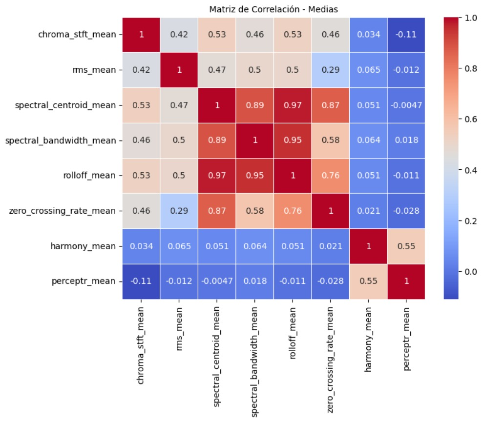
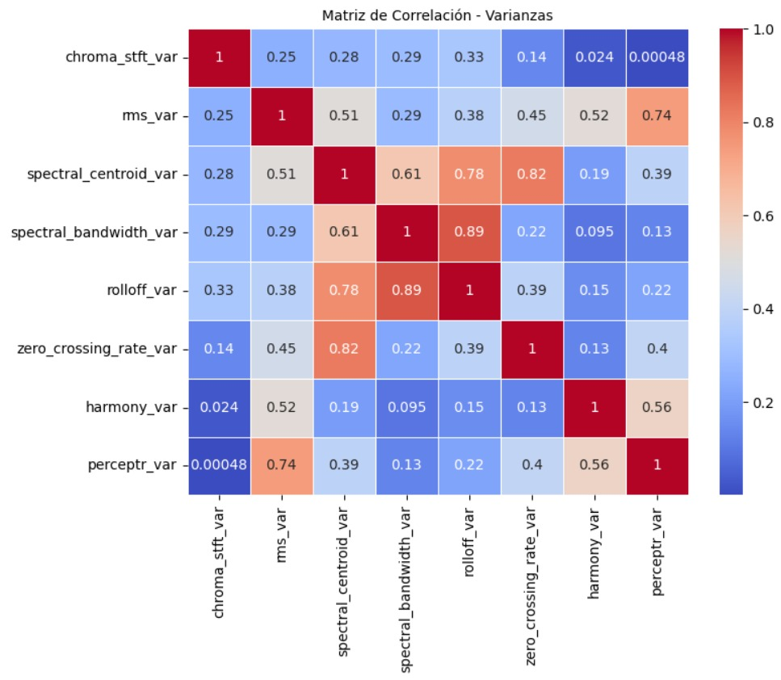
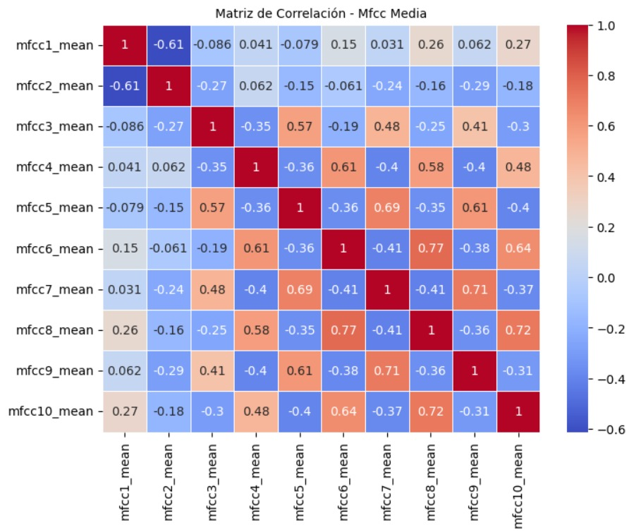
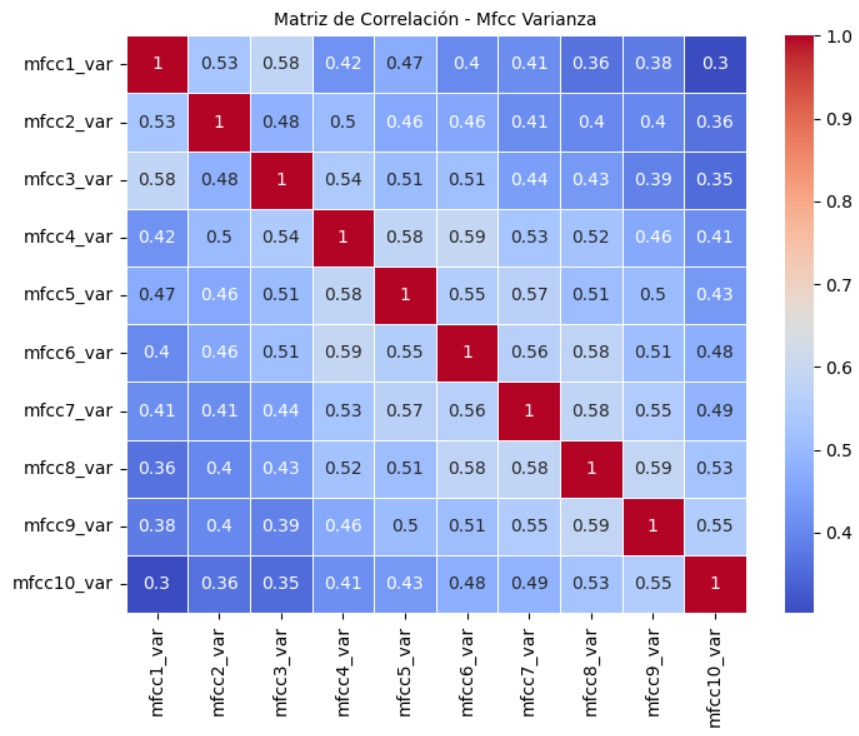

# Reporte de Datos

## Resumen general de los datos

Para entender el dataset que vamos a utilizar, es importante tener en cuenta que los archivos de audio originales son fragmentos de 30 segundos de una canción de un género específico. Cada fragmento se divide en 10 partes de 3 segundos que contienen características calculadas de la canción, tales como la caída espectral, característica cromática y la tasa de cruces por 0 entre otros. Esta división es relevante para nuestro proyecto debido a que se capturan más variaciones temporales y matices dentro del fragmento, lo cual es beneficioso para tareas de clasificación.

De esta manera, obtenemos un conjunto de datos que cuenta con un total de 9990 documentos.

## Resumen de calidad de los datos

Los tipos de datos más comunes en el dataframe son:

- float64 = 57 muestras
- object = 2 muestras
- int64 = 1 muestra

Del mismo modo, observamos que la calidad de nuestros datos es bastante alta pues obtenemos una confianza del 100% de que la información está bajo el encoding: ascii. Esto nos garantiza que no tendremos problemas de codificación.

## Variable objetivo

Para nuestro proyecto tenemos como meta una variable categórica, pues buscamos clasificar los fragmentos de las canciones por género, más específicamente 10.

[Blues, Classical, Country, Disco, Hiphop, Jazz, Metal, Pop, Reggae, Rock]

Asimismo, observamos que no existe desbalanceo de datos

## Relación entre variables

Para la correcta visualización de nuestras variables, vamos a separar las características en 4 grupos. 2 grupos principales (varianza y media) que guardan las características de corte espectral, centroide espectral, armonía, tasa de cruce por cero, entre otros; pues estos nos permiten detectar la presencia de ruido o sonidos agudos, analizar la disonancia y tonalidad, identificar que tan grave es un sonido, entre otros.

Y otros 2 grupos que únicamente contiene MFCCs (Coeficientes Cepstrales en Frecuencia Melódica) pues cada uno representa una "banda" diferente de frecuencias que permiten distinguir mejor los matices del audio.

Podemos observar que tanto para los valores de la media y varianza, las variables de centroide espectral, el ancho de banda espectral y pérdida gradual están altamente correlacionadas entre ellas. Por otro lado, cuando observamos los coeficientes cepstrales notamos que la correlación de sus valores de media o son medianamente elevados o no tienen relación alguna, mientras que para el caso de la varianza la correlación tiende a ser mucho más moderada entre todas. 

