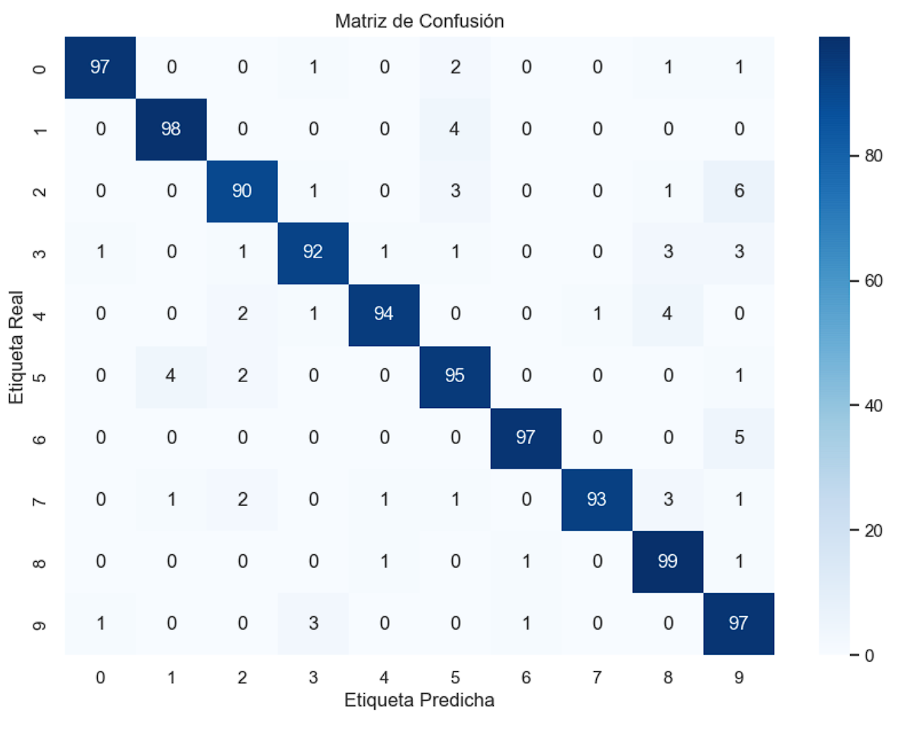

# Reporte del Modelo Final

## Descripción del Problema

Con el crecimiento exponencial de las plataformas de streaming y producción musical, los catálogos de audio se han vuelto gigantescos y diversos. Plataformas como Spotify, Apple Music, Deeezer, YouTube, entre otras, enfrentan constantemente el reto de ofrecer una experiencia personalizada y de alta calidad a sus usuarios. En este sentido, una clasificación precisa de géneros musicales es clave para mejorar la experiencia del usuario, ya que permite generar listas de reproducción, sugerir canciones similares y categorizar música de manera eficiente. De esta manera, este proyecto tiene como objetivo generar un modelo de clasificación automática de géneros musicales a partir de diferentes características de audio. Se hace uso de una red neuronal como modelo final debido a su capacidad para aprender patrones complejos en datos multidimensionales. A diferencia de los métodos clásicos de clasificación, como KNN o SVM, las redes neuronales son capaces de identificar relaciones no lineales y combinaciones de características que resultan cruciales para tareas de clasificación en un dominio tam amplio y variado como lo es el de la música.

## Descripción del Modelo

El modelo implementado es una red neuronal densa (DNN) diseñada para tareas de clasificación. Esto se evidencia por la estructura del mismo, pues incluye varias capas densas y una capa de salida con activación softmax. Esto nos permite predecir la pertenencia a una de las múltiples clases. En este caso, nuestro objetivo es clasificar las entradas en 10 categorías distintas.

**Redes Neuronales Densas (DNN):**

Se ha implementado un modelo de red neuronal densa que se compone de múltiples capas con activaciones ReLU y capas de dropout para prevenir el sobreajuste.

**Arquitectura del Modelo:**

La arquitectura de la DNN implementada en el código está diseñada para manejar la complejidad del problema de clasificación. Las múltiples capas densas permiten que nuestro modelo capture patrones complejos en los datos, mientras que las capas de dropout reducen el riesgo de sobreajuste al eliminar aleatoriamente un porcentaje de neuronas durante el entrenamiento.

**Uso de softmax:**

La función de activación softmax en la capa de salida nos proporciona una distribución de probabilidad sobre las 10 clases, permitiendo una interpretación clara de las salidas del modelo.

**Callback de Precisión:**

La inclusión de un callback que detiene el entrenamiento al alcanzar un umbral de precisión del 94%, nos asegura que el modelo no se entrene innecesariamente y se optimice el tiempo de entrenamiento.

## Evaluación del Modelo

| Modelo | Pérdida en prueba | Precisión en prueba |  
|--------|-------------------|---------------------|  
| **DNN** (baseline) | 1.0824 | 93.42% |  

En la matriz de confusión podemos visualizar los aciertos y desaciertos en pruebas. Por ejemplo, podemos observar que todos los desaciertos que tuvo el modelo para el genero de Classical los etiquetó como Jazz, pues si bien es un error propio del modelo, también es importante tener en cuenta la similitud que pueda existir entre las caracteristicas de audio de ambos géneros tal y como vimos en los fragmentos anteriores.

## Conclusiones y Recomendaciones

1. El modelo final tiene un 93% de precisión en prueba, lo que sugiere que es bastante efectivo para identificar patrones en las características de audio que distinguen los géneros musicales entre ellos.
2. Dado el buen desempeño, podemos confiar en que el modelo es adecuado para tareas de clasificación de géneros musicales. Esto podría ser útil para recomendaciones musicales y organización de librerias entre otros.
3. El 7% de errores puede provenir de similitudes entre características de audio en algunos géneros musicales (Jazz vs Classical) (Rock vs Metal)

## Referencias

1. [GTZAN Genre Classification Dataset](https://www.kaggle.com/code/imsparsh/gtzan-genre-classification-deep-learning-val-92-4/notebook#GTZAN---Deep-Learning).  
2. Documentación interna del proyecto, incluyendo los scripts.  
